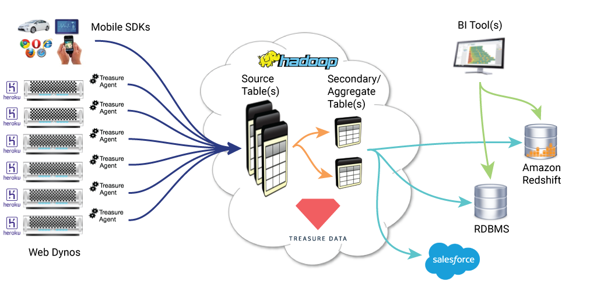

Treasure Data makes it incredibly easy to capture data from any source and store it to our scalable cloud platform. Our integration with Heroku puts the Treasure Agent on each one of your web dynos to capture log data, and any other custom events you track using our server side SDKs. Developers can also use our web and mobile SDKs to capture touch and click events from client-side apps as well.

  

All your data is aggregated into a schemaless datalake inside Treasure Data's completely managed cloud. From there, analysts and data scientists can run SQL queries on raw data to generate aggregate tables, and push them to many different types of external databases or third party tools for further analysis and visualization.

As your web dynos scale up or down with load on Heroku, Treasure Agent automatically adapts - making sure data is never lost, even during peak loading. Treasure Data is your turn-key analytics pipeline solution, making it effortless to aggregate, process, and export data for any application.
