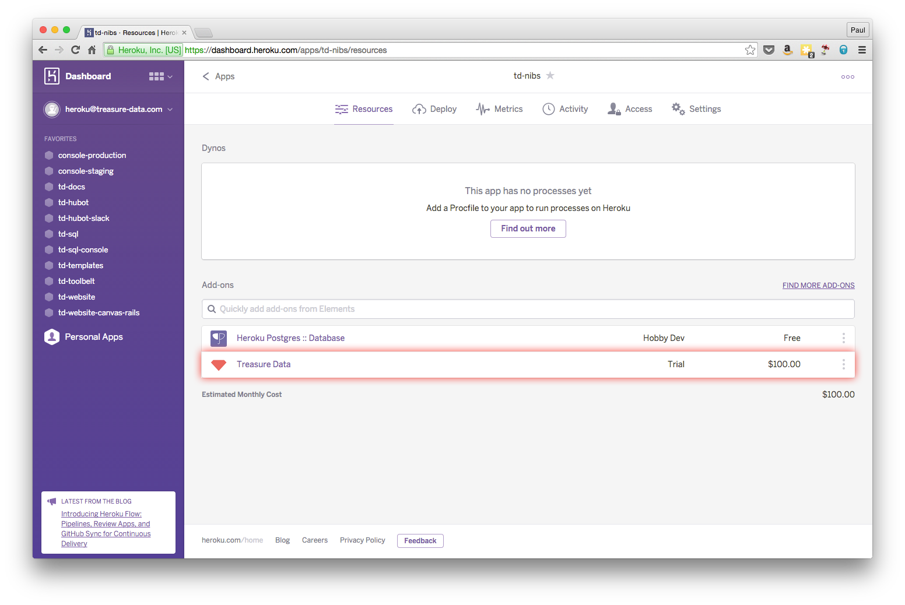
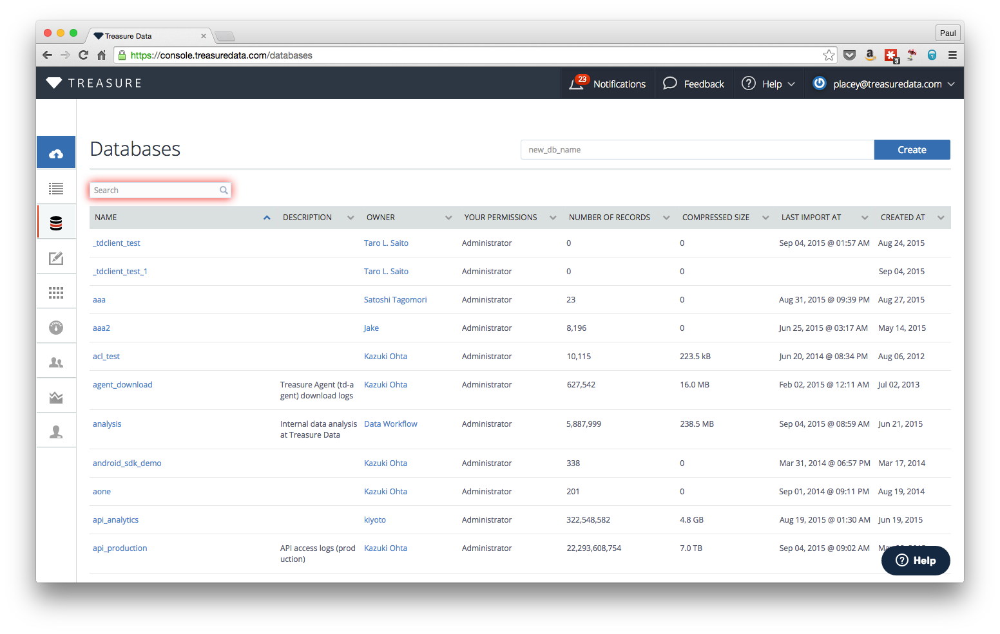
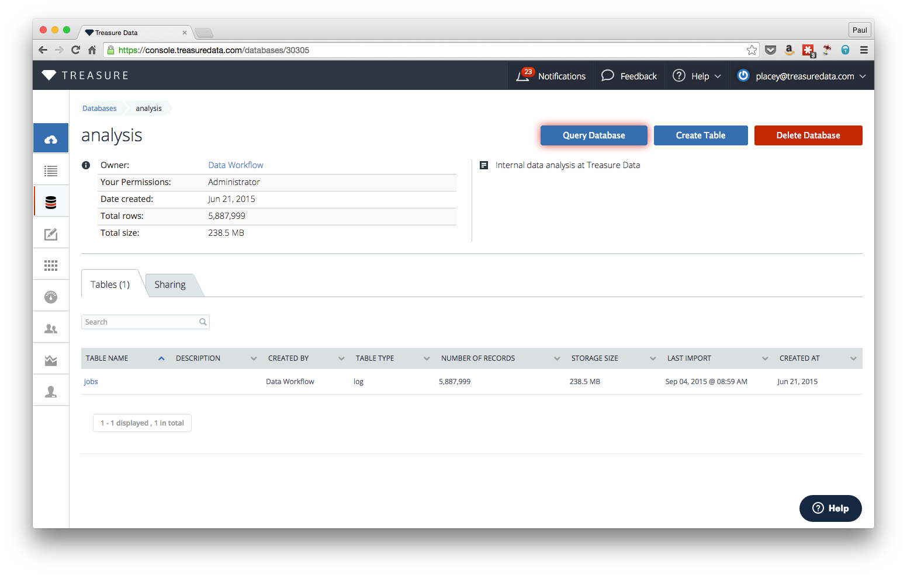
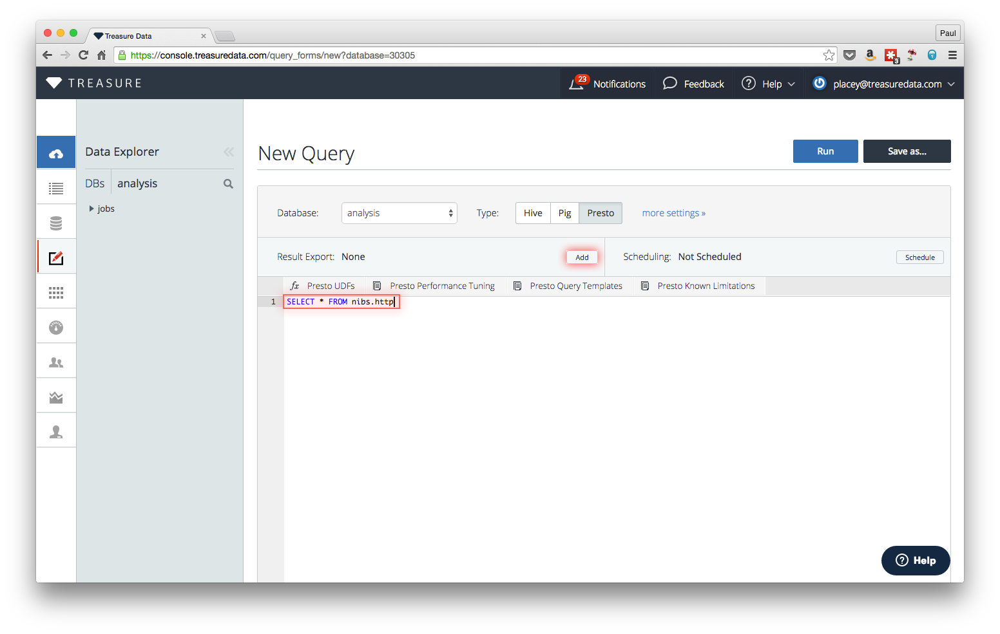
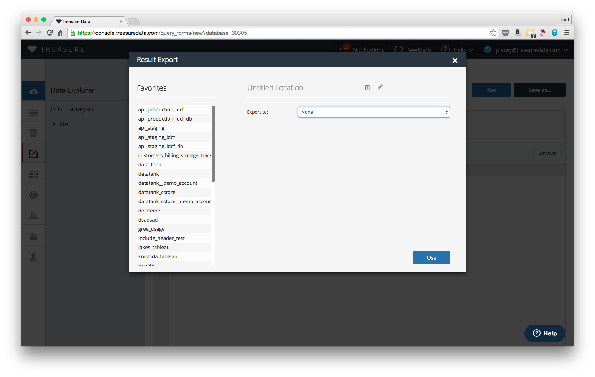
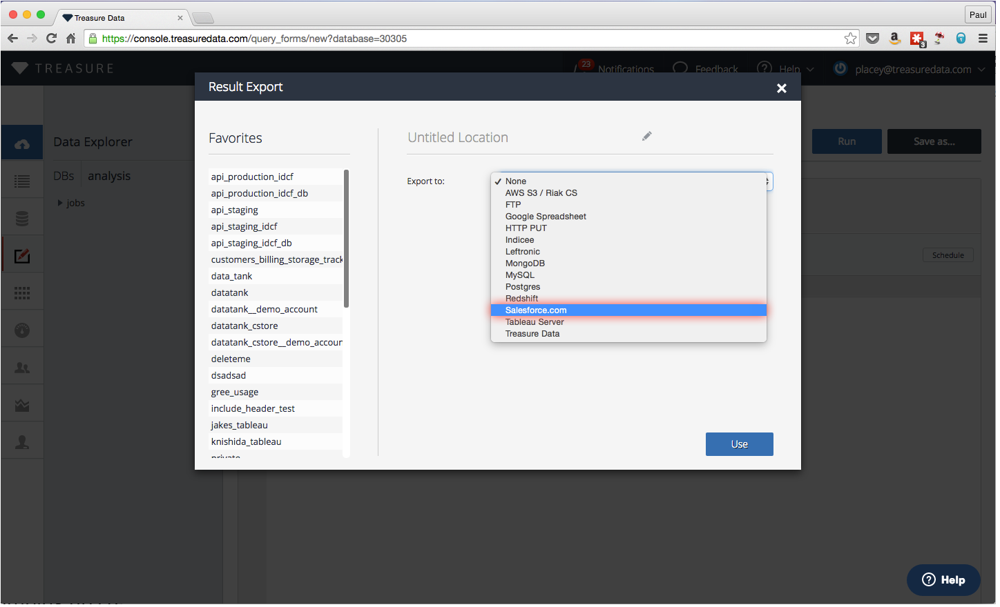
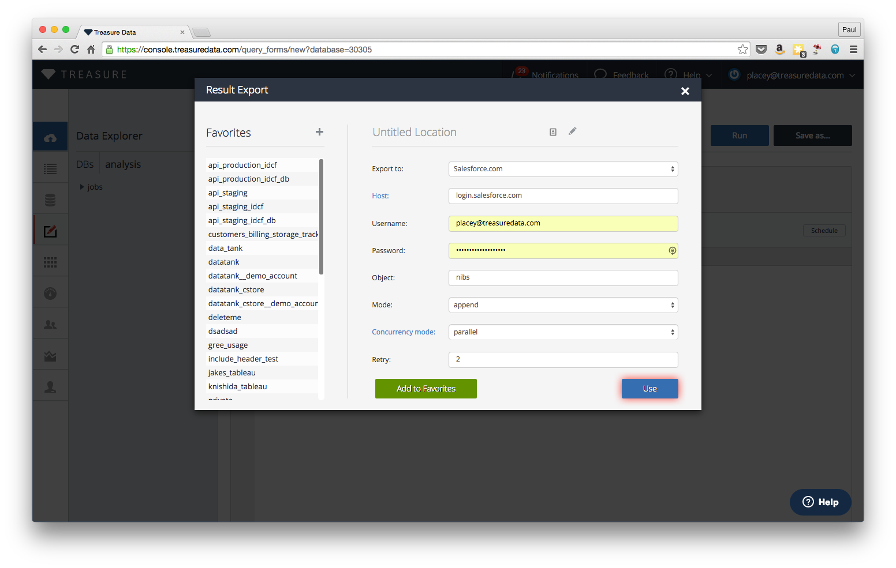
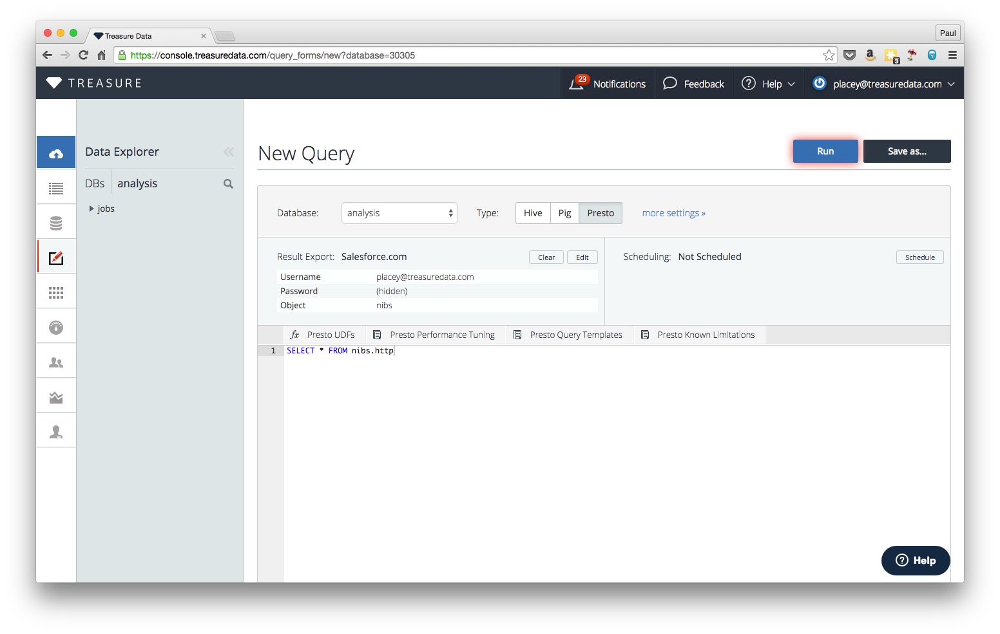

1. Launch Treasure Data Console from Heroku

  

1. Search for nibs.http database

  

1. Launch a new query

  

1. Write a SQL query to gather/aggregate your data, then add an external export destination

  

1. Explore export destinations

  

1. Select salesforce.com as output

  

1. Enter your salesforce login info

  

1. Run the query to aggregate and export results

  

1. To push results automatically, schedule this query to run periodically

  

